# State Machine Diagrams

This document contains state machine diagrams for all stateful components in the ChatterCheetah system.

---

## 1. Call State Machine

Voice calls progress through these states based on Twilio webhook callbacks.

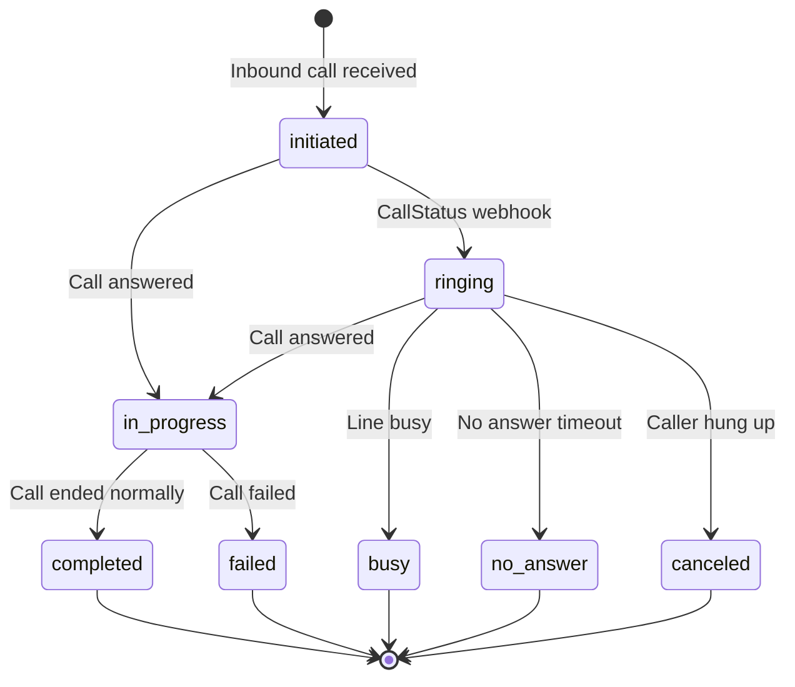

**Transitions triggered by:** Twilio `CallStatus` webhook at `/voice/status`

**Key fields:**
- `started_at` - Set when entering `in_progress`
- `ended_at` - Set on terminal states
- `duration` - Calculated from start/end times
- `recording_url` - Captured after completion

---

## 2. Escalation State Machine

Escalations are triggered by explicit user requests, low AI confidence, or manual admin action.

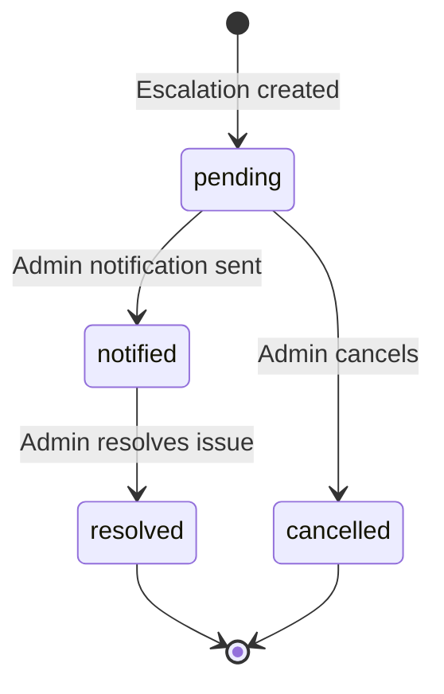

**Triggers:**
- `explicit_request` - User says "speak to human", "agent", "manager", etc.
- `low_confidence` - LLM confidence score < 0.5
- `manual` - Admin creates escalation manually

**Notification methods:** Email, SMS, In-app notification

---

## 3. Lead State Machine

Leads are captured from conversations and can auto-convert to Contacts.

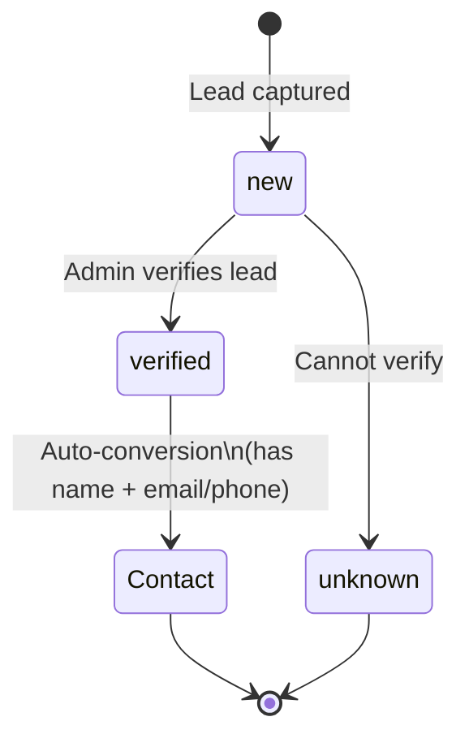

**Auto-conversion criteria:**
- Lead has a non-empty name
- AND (has email OR has phone number)

**Sources:** `voice_call`, `sms`, `email`, `web_chat`

---

## 4. SMS Opt-In State Machine

Manages customer SMS consent for compliance (TCPA).

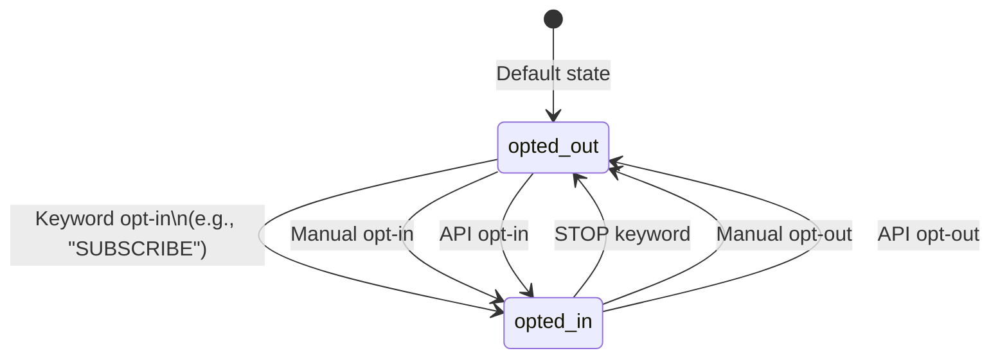

**Tracking:**
- `opted_in_at` / `opted_out_at` timestamps
- `opt_in_method` / `opt_out_method` for audit

---

## 5. SMS Delivery State Machine

Tracks outbound SMS delivery status via Twilio callbacks.

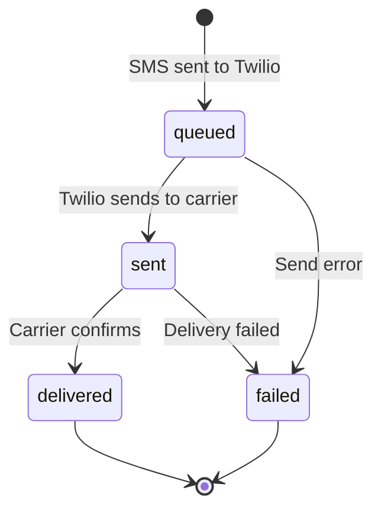

**Stored in:** `Message.message_metadata` JSON field
- `twilio_message_sid`
- `delivery_status`
- `status_updated_at`

---

## 6. Prompt Bundle State Machine

AI prompt templates progress through draft → testing → production.

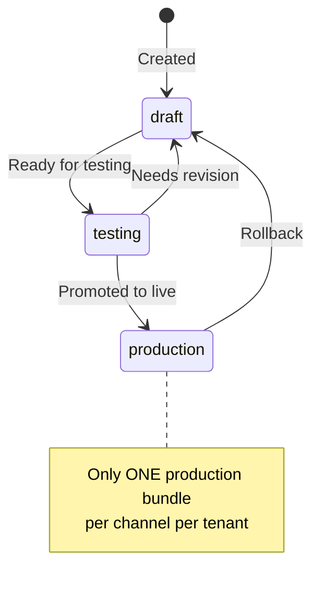

**Channels:** `chat`, `voice`, `sms`, `email`

**Constraint:** Unique partial index ensures only one `production` bundle per channel per tenant.

---

## 7. Email Conversation State Machine

Tracks email thread status for the Gmail responder feature.

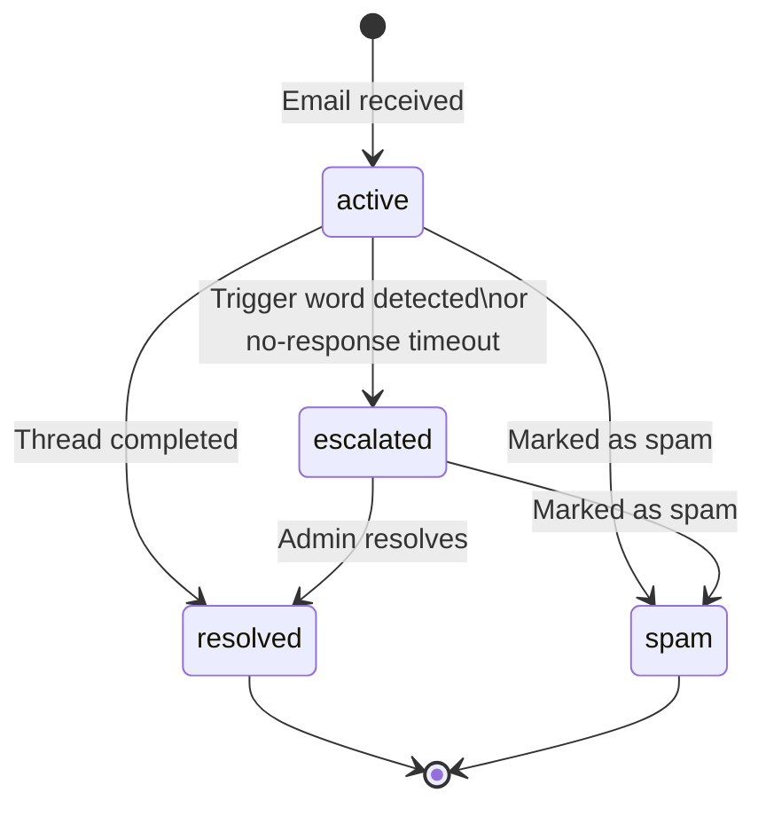

**Escalation triggers:**
- Keywords: "urgent", "complaint", "lawyer", "legal"
- Auto-escalate after N hours without response (configurable)

---

## 8. Zapier Request State Machine

Tracks async Zapier webhook request/response lifecycle.

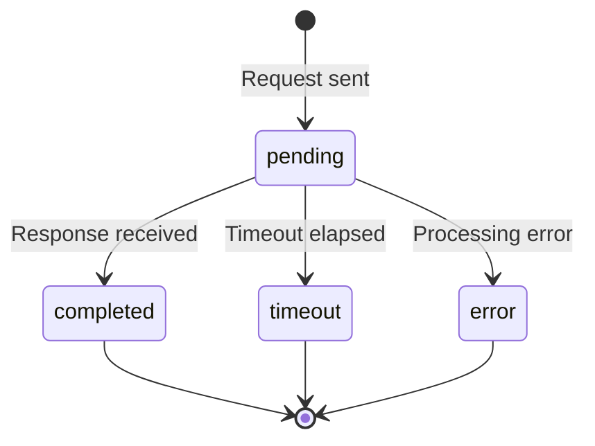

**Request types:** `customer_lookup`, `customer_query`

**Tracking:** `correlation_id` (UUID) for request/response matching

---

## 9. Notification State Machine

Simple read/unread tracking for user notifications.

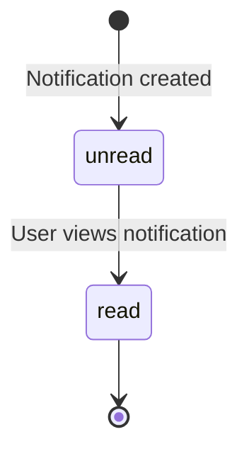

**Notification types:**
- `call_summary` - Call recording available
- `escalation` - Escalation alert
- `lead_captured` - New lead
- `handoff` - Transfer notification
- `voicemail` - Voicemail available
- `system` - System message
- `email_promise` - Promise fulfillment

**Priority levels:** `low`, `normal`, `high`, `urgent`

---

## 10. Call Summary Classification

Post-call AI classification of intent and outcome.

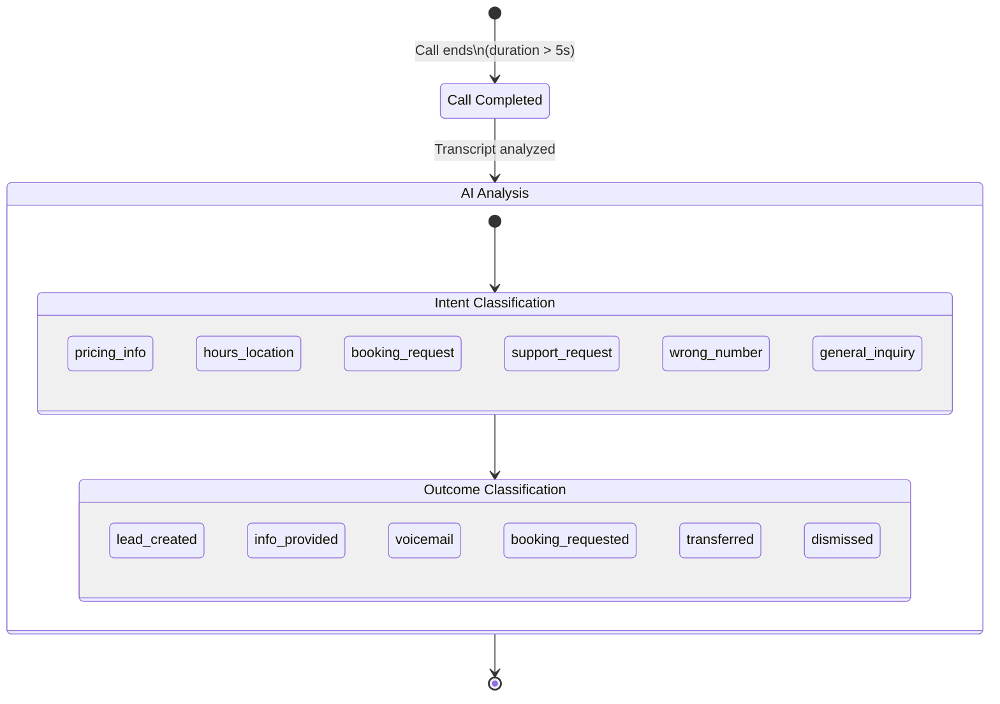

---

## 11. Contact State Machine

Contacts use soft-delete and merge patterns.

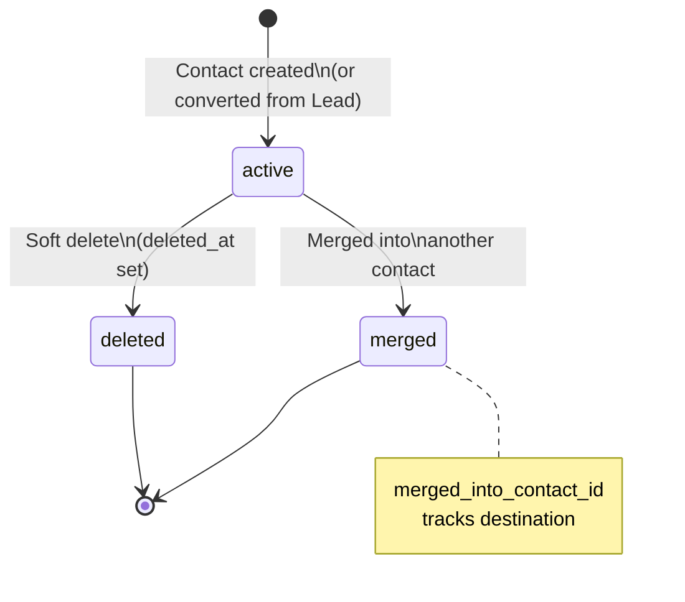

**Audit fields:**
- `deleted_at`, `deleted_by`
- `merged_at`, `merged_by`, `merged_into_contact_id`

---

## Summary Table

| Component | States | Primary Trigger |
|-----------|--------|-----------------|
| Call | initiated → ringing → in_progress → completed/failed/busy/no_answer/canceled | Twilio webhooks |
| Escalation | pending → notified → resolved/cancelled | Intent detection, keywords |
| Lead | new → verified → Contact | Info capture, auto-conversion |
| SMS Opt-In | opted_out ↔ opted_in | Keywords, manual, API |
| SMS Delivery | queued → sent → delivered/failed | Twilio status callbacks |
| Prompt Bundle | draft → testing → production | Manual promotion |
| Email Conversation | active → escalated → resolved/spam | Gmail events, triggers |
| Zapier Request | pending → completed/timeout/error | Webhook responses |
| Notification | unread → read | User action |
| Contact | active → deleted/merged | Admin action |

---

## File References

- **Models:** `app/persistence/models/`
- **Services:** `app/domain/services/`
- **Webhooks:** `app/api/routes/*_webhooks.py`
